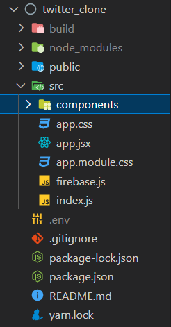
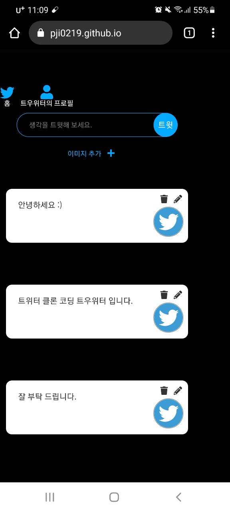
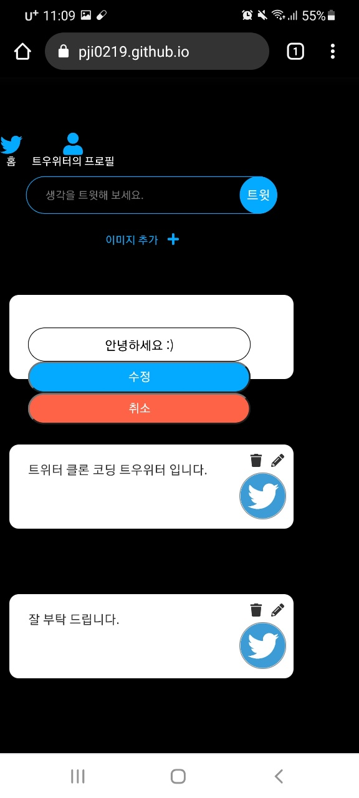

# 1. 개요

트위터 클론 코딩 프로젝트 입니다.<br>
<br>

### 프로젝트 실행 방법

루트 경로(twitter_clone)에서 npm start 입력<br>
<br>

### 프로젝트 URL

https://pji0219.github.io/twitter_clone/<br>
<br>

# 사용 기술

- postCSS, React, firebase
- 라이브러리: react-router-dom, uuid
- 배포: github pages<br>
  <br>

# 3. 기능과 코드

파일구조<br>
<br>
<br>

## (1) 회원가입, 로그인 기능

<br>
<br>

## src > components > auth > auth.jsx

파이어베이스의 인증서비스로 로그인 및 회원가입 기능을 구현, 구글과 깃허브 계정 로그인 기능도 파이어베이스 인증서비스에 연동해서 구현 하였습니다.<br>

```javascript
import React, { useState } from 'react';
import { authService, firebaseInstance } from '../../firebase';
import { FontAwesomeIcon } from '@fortawesome/react-fontawesome';
import {
  faTwitter,
  faGoogle,
  faGithub,
} from '@fortawesome/free-brands-svg-icons';
import styles from './auth.module.css';

function Auth() {
  const [email, setEmail] = useState();
  const [password, setPassword] = useState();
  const [newAccount, setNewAccount] = useState(false);
  const [error, setError] = useState();

  // 이메일과 비빌번호 입력
  const onChange = (event) => {
    const {
      target: { name, value },
    } = event;

    if (name === 'email') {
      setEmail(value);
    } else if (name === 'password') {
      setPassword(value);
    }
  };

  // 계정 생성 또는 로그인
  const onSubmit = async (event) => {
    event.preventDefault();
    try {
      if (newAccount) {
        // 계정 만들기
        await authService.createUserWithEmailAndPassword(email, password);
      } else {
        // 로그인
        await authService.signInWithEmailAndPassword(email, password);
      }
    } catch (error) {
      setError(error.message);
    }
  };

  // 눌렀을 때 이메일로 계정 생성 또는 이메일 로그인으로 전환
  const onToggleAccount = () => setNewAccount((prev) => !prev);

  // 구글 로그인 및 깃허브 로그인
  const onSocialLogin = async (event) => {
    const {
      target: { name },
    } = event;

    let provider;

    if (name === 'google') {
      provider = new firebaseInstance.auth.GoogleAuthProvider();
    } else if (name === 'github') {
      provider = new firebaseInstance.auth.GithubAuthProvider();
    }
    await authService.signInWithPopup(provider);
  };

  return (
    <div className={styles.auth_container}>
      <FontAwesomeIcon
        icon={faTwitter}
        color={'#04AAFF'}
        sizze='3x'
        style={{ marginBottom: 30 }}
      />

      <form onSubmit={onSubmit} className={styles.auth_form_container}>
        <input
          name='email'
          onChange={onChange}
          type='email'
          placeholder='이메일'
          required
          value={email || ''}
          className={styles.auth_input}
        />
        <input
          name='password'
          onChange={onChange}
          type='password'
          placeholder='비밀번호'
          required
          value={password || ''}
          className={styles.auth_input}
        />
        <input
          type='submit'
          className={styles.auth_submit}
          value={newAccount ? '계정 만들기' : '로그인'}
        />
        {error && <span className={styles.auth_error}>{error}</span>}
      </form>
      <span onClick={onToggleAccount} className={styles.auth_switch}>
        {newAccount ? '로그인' : '계정 만들기'}
      </span>
      <div className={styles.login_btns}>
        <button
          name='google'
          onClick={onSocialLogin}
          className={styles.login_btn}
        >
          구글 로그인 <FontAwesomeIcon icon={faGoogle} />
        </button>
        <button
          name='github'
          onClick={onSocialLogin}
          className={styles.login_btn}
        >
          깃허브 로그인 <FontAwesomeIcon icon={faGithub} />
        </button>
      </div>
    </div>
  );
}

export default Auth;
```

## (2) 홈페이지의 트윗 CRUD기능


<br>
<br>

## src > components > home > home.jsx

DB에 있는 트윗들을 모두 조회해 줍니다.<br>

```javascript
import React, { useEffect, useState } from 'react';
import { dbService } from '../../firebase';
import Tweet from '../tweet/tweet';
import TweetMaker from '../tweet-maker/tweet-maker';
import styles from './home.module.css';

function Home({ userObj }) {
  const [tweets, setTweets] = useState([]);

  useEffect(() => {
    // DB에 있는 트윗 조회
    const getTweets = () => {
      // DB에 일어나는 작업들 실시간 감지 (데이터 CRUD) 하고 데이터 조회
      dbService
        .collection('tweets')
        .orderBy('createdAt', 'desc')
        .onSnapshot((snapshot) => {
          const tweetArray = snapshot.docs.map((doc) => ({
            id: doc.id,
            ...doc.data(),
          }));
          setTweets(tweetArray);
        });
    };
    getTweets();
  }, []);

  return (
    <div className={styles.container}>
      <TweetMaker userObj={userObj} />
      <div className={styles.tweet_container}>
        {tweets.map((tweet) => (
          <Tweet
            key={tweet.id}
            tweetObj={tweet}
            isOwner={tweet.creatorId === userObj.uid}
          />
        ))}
      </div>
    </div>
  );
}

export default Home;
```

## components > tweet > tweet.jsx

파이어베이스 파이어스토어 서비스로 db에 있는 트윗을 수정, 삭제 할 수 있게 구현 하였습니다.

```javascript
import React, { useState } from 'react';
import { dbService, storageService } from '../../firebase';
import styles from './tweet.module.css';
import { FontAwesomeIcon } from '@fortawesome/react-fontawesome';
import { faTrash, faPencilAlt } from '@fortawesome/free-solid-svg-icons';

function Tweet({ tweetObj, isOwner }) {
  const [update, setUpdate] = useState(false);
  const [newTweet, setNewTweet] = useState(tweetObj.text);

  // 트윗 삭제
  const onDelete = async () => {
    const delteConfirm = window.confirm('트윗을 삭제 하시겠습니까?');

    // 확인창의 확인 버튼 누르면 삭제 (true 반영)
    if (delteConfirm) {
      // 트윗 삭제
      await dbService.doc(`tweets/${tweetObj.id}`).delete();
      // 트윗의 사진 삭제
      await storageService.refFromURL(tweetObj.imgFileUrl).delete();
    }
  };

  // 수정 버튼 누를시 수정 내용 입력하는 창 나옴
  const toggleUpdate = () => setUpdate((prev) => !prev);

  // 트윗 수정
  const onChange = (event) => {
    setNewTweet(event.target.value);
  };

  // 수정된 내용 DB에 반영
  const onSubmit = async (event) => {
    event.preventDefault();

    // DB 수정
    await dbService.doc(`tweets/${tweetObj.id}`).update({
      text: newTweet,
    });

    // 수정하는 입력 창 없앰
    setUpdate(false);
  };

  return (
    <div className={styles.tweet}>
      {update ? (
        <form onSubmit={onSubmit} className={styles.tweet_update}>
          <input
            onChange={onChange}
            type='text'
            placeholder='트윗 내용을 수정하세요.'
            value={newTweet}
            required
            className={styles.form_input}
          />
          <button type='submit' className={styles.form_btn}>
            수정
          </button>
          <button onClick={toggleUpdate} className={styles.cancel_btn}>
            취소
          </button>
        </form>
      ) : (
        <>
          <h4>{tweetObj.text}</h4>
          {tweetObj.imgFileUrl && (
            
          )}
          {isOwner && (
            <div className={styles.tweet_actions}>
              <span onClick={onDelete}>
                <FontAwesomeIcon icon={faTrash} />
              </span>
              <span onClick={toggleUpdate}>
                <FontAwesomeIcon icon={faPencilAlt} />
              </span>
            </div>
          )}
        </>
      )}
    </div>
  );
}

export default Tweet;
```

## src > components > tweet-maker > tweet-maker.jsx

파이어베이스의 파이어 스토어와 스토리지에 트윗과 트윗 이미지를 저장 하도록 구현 하였습니다.

```javascript
import React, { useState } from 'react';
import { dbService, storageService } from '../../firebase';
import { v4 as uuidv4 } from 'uuid';
import styles from './tweet-maker.module.css';
import { FontAwesomeIcon } from '@fortawesome/react-fontawesome';
import { faPlus, faTimes } from '@fortawesome/free-solid-svg-icons';

function TweetMaker({ userObj }) {
  const [tweet, setTweet] = useState();
  const [imgFile, setImgFile] = useState('');

  // 트윗 내용 입력
  const onChange = (event) => {
    setTweet(event.target.value);
  };

  // 트윗 DB에 저장
  const onSubmit = async (event) => {
    event.preventDefault();

    let imgFileUrl = '';

    if (imgFile !== '') {
      /* 파일에 대한 레퍼런스를 만듦 
      (user id와 uuid로 준 랜덤 값과 함께 
      ( user id는 스토리지에 id별로 폴더를 만들게 되서 user별로 구분이 되게 하고 
      uuid로 사진 이름을 랜덤한 값으로 되게 함))
      */
      const fileRef = storageService.ref().child(`${userObj.uid}/${uuidv4()}`);

      // 그 후 이미지 파일을 data url형식 (문자열)으로 레퍼런스에 업데이트 (스토리지에 저장됨)
      const response = await fileRef.putString(imgFile, 'data_url');

      /* 그 다음 스토리지에 저장된 이미지를 url형식으로 가져옴 (트윗에 넣기 위해서)
        그것을 변수에 재할당
      */
      imgFileUrl = await response.ref.getDownloadURL();
    }

    // DB에 트윗 내용과 이미지 저장
    await dbService.collection('tweets').add({
      text: tweet,
      createdAt: Date.now(),
      creatorId: userObj.uid,
      imgFileUrl,
    });

    // DB에 트윗 저장후 state 빈 문자열로 바꿈
    setTweet('');

    // DB에 저장 후 이미지 state를 빈 문자열로 바꿈
    setImgFile('');
  };

  // 이미지 올린 것을 화면에 보여줌 (미리보기)
  const onFileChange = (event) => {
    const theFile = event.target.files[0];

    // 파일 읽는 웹 API
    const reader = new FileReader();

    // 이미지가 올려져 있으면 파일명 화면에 표시
    if (Boolean(theFile)) {
      reader.readAsDataURL(theFile);
    }

    // 이미지 로딩 이벤트 끝나고 문자열로 브라우저상에 저장된 이미지 파일 state에 넣음
    reader.onloadend = (finishedEvent) => {
      setImgFile(finishedEvent.currentTarget.result);
    };
  };

  // 이미지 지우기
  const onClearImage = () => setImgFile('');

  return (
    <>
      <form onSubmit={onSubmit} className={styles.maker_form}>
        <div className={styles.maker_input_container}>
          <input
            type='text'
            placeholder='생각을 트윗해 보세요.'
            maxLength={120}
            value={tweet || ''}
            onChange={onChange}
            className={styles.maker_input_tweet}
          />
          <input
            type='submit'
            value='트윗'
            className={styles.maker_input_submit}
          />
        </div>
        <label for='img-file' className={styles.maker_input_label}>
          <span>이미지 추가</span>
          <FontAwesomeIcon icon={faPlus} />
        </label>
        <input
          id='img-file'
          type='file'
          accept='image/*'
          onChange={onFileChange}
          className={styles.maker_input_img}
        />
        {imgFile && (
          <div className={styles.maker_form_img}>
            
            <div
              className={styles.maker_form_img_remove}
              onClick={onClearImage}
            >
              <span>이미지 삭제</span>
              <FontAwesomeIcon icon={faTimes} />
            </div>
          </div>
        )}
      </form>
    </>
  );
}

export default TweetMaker;
```

## (3) 프로필 수정 기능

<br>
<br>

## src > components > profile > profile.jsx

파이어베이스의 인증서비스를 통해 프로필 수정과 로그아웃 기능을 구현하였습니다.

```javascript
import React, { useState } from 'react';
import { authService } from '../../firebase';
import { useHistory } from 'react-router-dom';
import styles from './profile.module.css';

function Profile({ userObj, refreshUser }) {
  const [newProfileName, setNewProfileName] = useState(userObj.displayName);
  const history = useHistory();

  // 로그아웃
  const onLogOut = () => {
    authService.signOut();
    history.push('/');
  };

  // 프로필 이름 수정
  const onChange = (event) => {
    setNewProfileName(event.target.value);
  };

  // 프로필 이름 수정 사항 적용
  const onSubmit = async (event) => {
    event.preventDefault();

    // 현재 프로필 이름과 수정 입력창에 입력한 프로필 이름이 다르면 업데이트 시킴
    if (userObj.displayName !== newProfileName) {
      await userObj.updateProfile({
        displayName: newProfileName,
      });

      // 프로필 이름 변경 nav에도 적용
      refreshUser();
    }
  };

  return (
    <div className={styles.container}>
      <form onSubmit={onSubmit} className={styles.Profile_form}>
        <input
          type='text'
          placeholder='프로필 이름 입력'
          onChange={onChange}
          value={newProfileName}
          className={styles.form_input}
        />
        <input type='submit' value='프로필 수정' className={styles.form_btn} />
      </form>
      <button onClick={onLogOut} className={styles.log_out}>
        로그아웃
      </button>
    </div>
  );
}

export default Profile;
```
